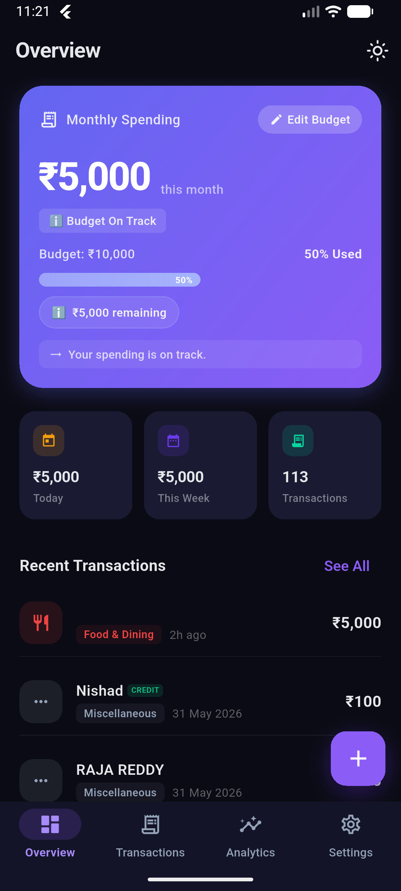
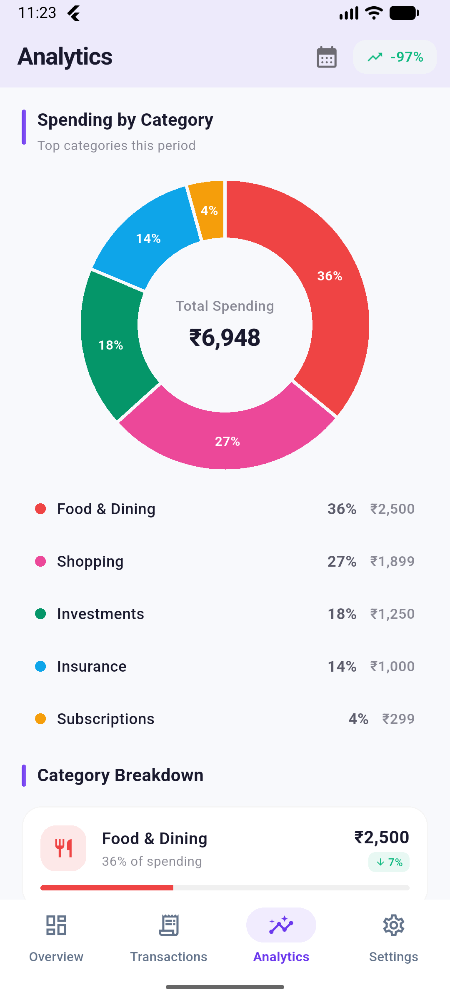

# 🪙 PennyTracker

<p align="center">
  
</p>

<h3 align="center">PennyTracker</h3>

<p align="center">
  <em>Smart, automated, and secure personal finance management.</em>
</p>

<p align="center">
  
  
  
  
</p>

<p align="center">
  <a href="https://github.com/Maddy0057/PennyTracker/releases/latest">
    
  </a>
</p>

<p align="center">
  <i>New to GitHub? Click the green button above to download the latest version of PennyTracker.</i>
</p>

<p align="center">
  <a href="#-getting-started">
    
  </a>
</p>

---

## 📖 Project Overview

PennyTracker is a high-performance personal finance manager designed to solve the "manual entry fatigue" of typical expense trackers. By leveraging advanced **on-device parsing**, it captures transaction data directly from bank SMS and digital payment statements (PhonePe, GPay, Paytm) with zero cloud dependency.

### Why PennyTracker?
- **Efficiency:** Most expenses are tracked automatically via background SMS detection.
- **Privacy:** Your financial DNA never leaves your device. No backend, no trackers.
- **Insights:** Interactive analytics help you identify spending leaks and optimize your budget.

---

## 📱 Core Visuals

<table style="width:100%; border:none; text-align:center;">
  <tr>
    <td width="33%"><b>Premium Light UI</b></td>
    <td width="33%"><b>Immersive Dark Mode</b></td>
    <td width="33%"><b>Interactive Analytics</b></td>
  </tr>
  <tr>
    <td></td>
    <td></td>
    <td></td>
  </tr>
  <tr>
    <td colspan="3"><i>Selected previews of the Home Dashboard, Dark Theme support, and Category Analytics.</i></td>
  </tr>
</table>

---

## 🛠️ Deep Technical Architecture

### 🤖 The Intelligence Engine (Parsing)
At the heart of PennyTracker is a sophisticated parsing layer that translates unstructured text into structured financial data.
- **`SMSParserService`**: Uses optimized Regular Expressions to scan incoming notifications for currency patterns, merchant keywords, and transaction IDs.
- **Specialized Parsers**: Custom logic for **PhonePe**, **GPay**, and **Paytm** to handle unique statement formats and bulk PDF imports.
- **Duplicate Reconciliation**: Intelligent matching logic ensures that a transaction parsed from an SMS isn't duplicated when importing a PDF statement.

### 📦 Data & Persistence
- **Hive NoSQL**: We use Hive for its incredible speed. It handles complex objects like `TransactionModel` and `Budget` with generated `TypeAdapters`.
- **HiveObjects**: Models extend `HiveObject`, allowing for easy management of locally stored data with auto-incrementing keys and direct delete/save capabilities.

### 🏗️ State & Logic Flow
- **Riverpod Providers**: The UI remains lightweight by delegating logic to specialized providers:
  - `ExpenseProvider`: Manages the global transaction state and filtering.
  - `AnalyticsProvider`: Computes complex spending metrics on-the-fly for charts.
  - `ThemeProvider`: Handles seamless context switching between light and dark modes.

---

## ✨ Key Features

- **🚀 Automated Tracking:** Real-time background detection of UPI and Bank transactions.
- **📊 Advanced Analytics:** Weekly and monthly breakdowns with interactive `fl_chart` components.
- **🎯 Smart Budgeting:** Set category-wise limits and receive local notifications when nearing thresholds.
- **📁 Data Portability:** Comprehensive PDF export/import and local encrypted backups.
- **⚡ Performance:** Built with Flutter for 60FPS animations and instant responsiveness.

---

## 📂 Project Structure

```text
lib/
├── core/           # App-wide constants, themes, and Material 3 widgets
├── data/           # Hive Models (Transaction, Budget, Category) & Adapters
├── domain/         # Repository interfaces and business logic
├── navigation/     # GoRouter type-safe path configurations
├── parsers/        # The "Brain" - Regex logic for SMS and PDF formats
├── presentation/   # Feature-based screens & Riverpod state controllers
└── services/       # SMS Listeners, PDF Engines, and Local Notifications
```

---

## 🛠️ Built With

<p align="left">
  
  
  
  
</p>

---

## 📦 Getting Started

1. **Clone & Setup:**
   ```bash
   git clone https://github.com/Maddy0057/PennyTracker.git
   cd PennyTracker
   flutter pub get
   ```
2. **Run Application:**
   ```bash
   flutter run
   ```

---

## 📄 License

Distributed under the MIT License. See `LICENSE` for more information.

<p align="right">(<a href="#top">back to top</a>)</p>
