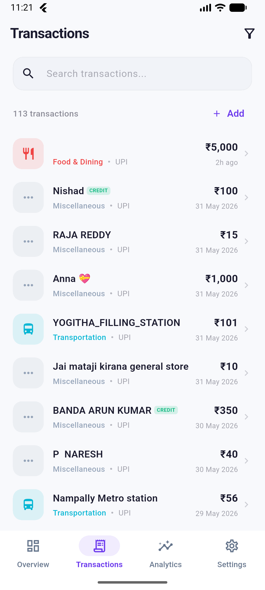
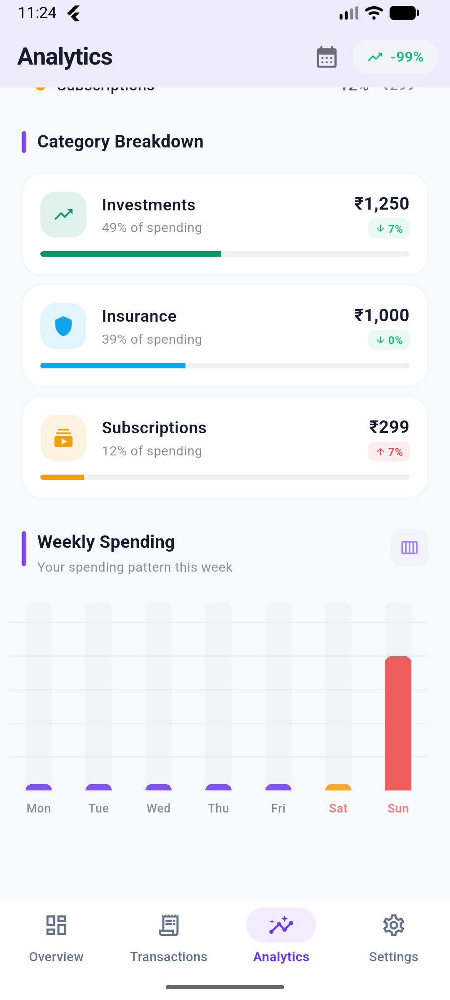
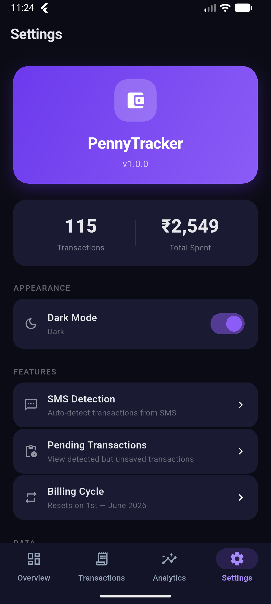

# 🪙 PennyTracker

<p align="center">
  
</p>

<h3 align="center">PennyTracker</h3>

<p align="center">
  <em>Smart, automated, and secure personal finance management.</em>
</p>

<p align="center">
  
  
  
  
</p>

<p align="center">
  <a href="https://github.com/Maddy0057/PennyTracker/releases/latest">
    
  </a>
  <a href="#-getting-started">
    
  </a>
</p>

---

## ✨ Features

- **🤖 Automated Magic:** Zero-effort tracking with SMS and PDF parsing for PhonePe, GPay, and Paytm.
- **📊 Visual Intelligence:** Beautifully crafted interactive charts and spending heatmaps powered by `fl_chart`.
- **🔐 Privacy First:** Your data is yours. Local-first storage with Hive ensures 100% offline privacy.
- **💡 Smart Insights:** Automatic categorization and budget intelligence that learns your habits.
- **🌓 Adaptive UI:** Premium design language with seamless Light and Dark mode transitions.
- **📦 Data Freedom:** Export your history to PDF or create encrypted backups for total peace of mind.

---

## 📱 Visual Experience

<table style="width:100%; border:none; text-align:center;">
  <tr>
    <td width="33%"><b>Modern Light Theme</b></td>
    <td width="33%"><b>Premium Dark Theme</b></td>
    <td width="33%"><b>Dynamic Analytics</b></td>
  </tr>
  <tr>
    <td></td>
    <td></td>
    <td></td>
  </tr>
  <tr>
    <td><b>Smart History</b></td>
    <td><b>Visual Trends</b></td>
    <td><b>Power Tools</b></td>
  </tr>
  <tr>
    <td></td>
    <td></td>
    <td></td>
  </tr>
</table>

---

## 🛠️ Built With

<p align="left">
  
  
  
  
  
</p>

- **State Management:** Riverpod (Declarative, safe, and testable)
- **Local Database:** Hive (NoSQL, high performance)
- **Navigation:** GoRouter (Type-safe routing)
- **Animations:** Flutter Animate & Shimmer
- **Analytics:** fl_chart (Interactive visualizations)

---

## 🔍 How It Works

### 1. Automated Transaction Engine
The core of PennyTracker is its **multi-source parsing engine**. It doesn't just read messages; it understands financial context.
- **Real-time SMS Detection:** Listens for transaction patterns and extracts details before you even open the app.
- **Statement Intelligence:** Parses complex PDF structures from major UPI providers with automatic duplicate reconciliation.

### 2. Privacy-Centric Architecture
We believe your financial data shouldn't leave your pocket.
- **Local-First:** No cloud servers, no trackers.
- **Hive Persistence:** Data is stored in encrypted-ready binary format for maximum speed and security.

### 3. Reactive Insights
Your dashboard updates as you spend.
- **Riverpod Sync:** Every transaction triggers a reactive update across the entire app state, from budget cards to analytics.

---

## 📂 Project Structure

```text
lib/
├── core/           # App-wide constants, themes, and shared widgets
├── data/           # Models, adapters, and Hive data sources
├── domain/         # Business logic and abstract repositories
├── navigation/     # App routing and deep links
├── parsers/        # Specialized logic for SMS/PDF parsing
├── presentation/   # UI screens and Riverpod providers
└── services/       # SMS, PDF, and Notification infrastructure
```

---

## 📦 Getting Started

### Installation

1. **Clone & Enter:**
   ```bash
   git clone https://github.com/Maddy0057/PennyTracker.git
   cd PennyTracker
   ```
2. **Fetch Packages:**
   ```bash
   flutter pub get
   ```
3. **Run App:**
   ```bash
   flutter run
   ```

---

## 🤝 Contributing

Contributions make the open-source community an amazing place! Any contributions you make are **greatly appreciated**.

1. Fork the Project
2. Create your Feature Branch (`git checkout -b feature/AmazingFeature`)
3. Commit your Changes (`git commit -m 'Add some AmazingFeature'`)
4. Push to the Branch (`git push origin feature/AmazingFeature`)
5. Open a Pull Request

---

## 📄 License

Distributed under the MIT License. See `LICENSE` for more information.

<p align="right">(<a href="#top">back to top</a>)</p>
